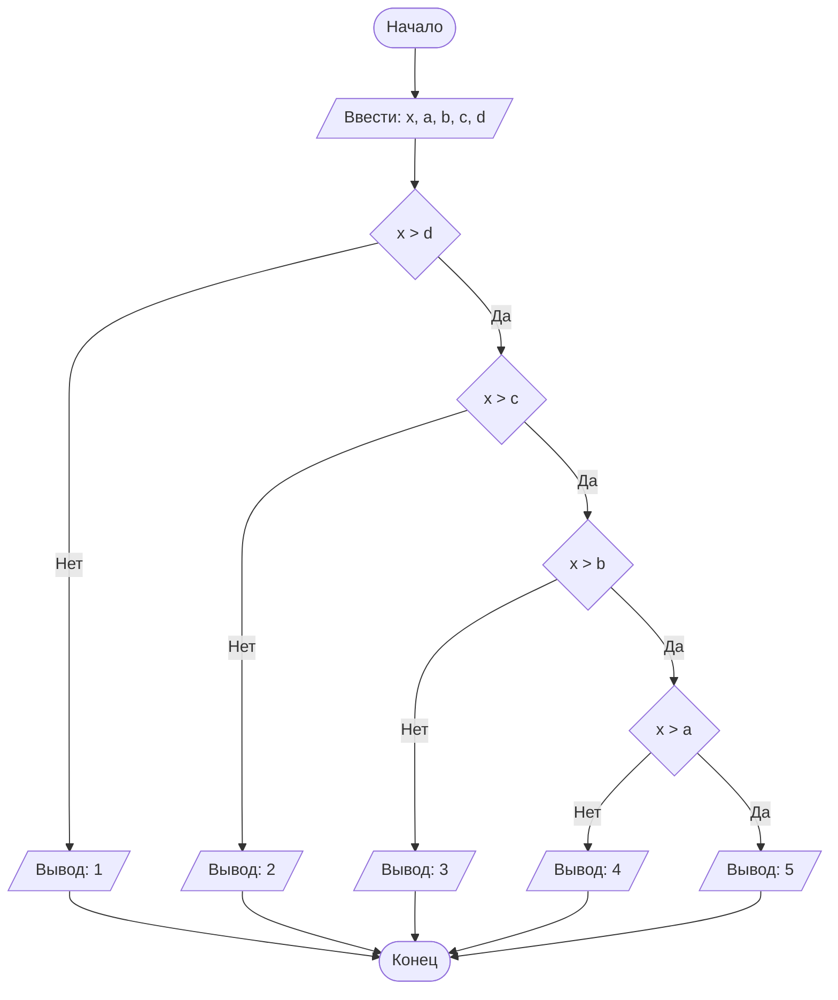

## Отчет по лабораторной работе № 1

#### № группы: `ПМ-2401`

#### Выполнил: `Селезнева Екатерина Михайловна`

#### Вариант: `25`

### Cодержание:

- [Постановка задачи](#1-постановка-задачи)
- [Входные и выходные данные](#2-входные-и-выходные-данные)
- [Выбор структуры данных](#3-выбор-структуры-данных)
- [Алгоритм](#4-алгоритм)
- [Программа](#5-программа)
- [Анализ правильности решения](#6-анализ-правильности-решения)

### 1. Постановка задачи

> Набор из пяти доминошек высоты X устанавливают на расстоянии A, B,
C, D друг от друга в указанном порядке. После этого крайнюю доминошку
роняют в направлении других доминошек. Какое количество доминошек
упадет в результате? Считать, что доминошки имеют нулевую толщину и
что доминошка упадет, если её коснётся предыдущая. На вход программы
подаются натуральные числа X, A, B, C, D.

В данной задаче нужно поочередно сравнивать D, C, B и A с X.
Если расстояние (A,B,C или D) между упавшей доминошкой и следующей меньше их высоты (X), 
то следующая доминошка тоже упадет.


### 2. Входные и выходные данные

#### Данные на вход

На вход программа должна получать 5 чисел, при этом в условии не сказано, к какому множеству
принадлежать получаемые числа, поэтому будем считать их вещественными. 

|             | Тип                | min значение | max значение |
|-------------|--------------------|--------------|--------------|
| X (Число 1) | Вещественное число | 0            |10<sup>9</sup>|
| A (Число 2) | Вещественное число | 0            |10<sup>9</sup>|
| B (Число 3) | Вещественное число | 0            |10<sup>9</sup>|
| C (Число 4) | Вещественное число | 0            |10<sup>9</sup>|
| D (Число 5) | Вещественное число | 0            |10<sup>9</sup>|


#### Данные на выход

Т.к. программа должна вывести количество упавших доминошек, то на выход мы получим
единственное целое неотрицательное число, не превышающее 5 (т.к. доминошек всего 5).

|         | Тип                         | min значение | max значение |
|---------|-----------------------------|--------------|--------------|
| Число 1 | Целое неотрицательное число | 1            | 5            |

### 3. Выбор структуры данных

Программа получает 5 вещественных числа. Поэтому для их хранения
можно выделить 5 переменных (`x`, `a`,`b`,`c` и `d`) типа `double`.

|             | название переменной | Тип (в Java) | 
|-------------|---------------------|--------------|
| X (Число 1) | `x`                 | `double`     |
| A (Число 2) | `a`                 | `double`     | 
| B (Число 3) | `b`                 | `double`     |
| C (Число 4) | `c`                 | `double`     | 
| D (Число 5) | `d`                 | `double`     |


Для вывода результата необязательно его хранить в отдельной переменной.

### 4. Алгоритм

#### Алгоритм выполнения программы:

1. **Ввод данных:**  
   Программа считывает 5 вещественных чисел, обозначенные как `x`, `a`,`b`,`c` и `d`.

2. **Сравнение расстояний между доминошками и их высоты:**  
   1) Программа сравнивает значения `x` и `d`. Если `x` больше `d`, то 5-ая доминошка заденет 4-ую, программа переходит 
      к следующему сравнению. Если `d` больше или равно `x`, упадет только 5-ая доминошка, программа выводит 1 и заканчивает работу.
   2) Программа сравнивает значения `x` и `с`. Если `x` больше `с`, то 4-ая доминошка заденет 3-ую, программа переходит
      к следующему сравнению. Если `с` больше или равно `x`, упадут только 4-ая и 5-ая доминошки, программа выводит 2 и заканчивает работу.
   3) Программа сравнивает значения `x` и `b`. Если `x` больше `b`, то 3-ая доминошка заденет 2-ую, программа переходит
      к следующему сравнению. Если `b` больше или равно `x`, упадут 3-я, 4-ая и 5-ая доминошки, программа выводит 3 и заканчивает работу.
   4) Программа сравнивает значения `x` и `a`. Если `x` больше `a`, то 2-ая доминошка заденет 1-ую, значит упадут все доминошки, программа выводит 5. Если `a` больше или          равно `x`, упадут 2-ая, 3-я, 4-ая и 5-ая доминошки, программа выводит 4 и заканчивает работу.

3. **Вывод результата:**  
   На экран выводится число упавших доминошек.

#### Блок-схема



### 5. Программа

```java
import java.io.PrintStream;
import java.util.Scanner;
import java.io.IOException;
public class Main {
   // Объявляем объект класса Scanner для ввода данных
   public static Scanner in = new Scanner(System.in);
   // Объявляем объект класса PrintStream для вывода данных
   public static PrintStream out = System.out;
   public static void main(String[] args) throws IOException {
      // Считывание пяти вещественных чисел x, a, b, c, d из консоли
      double x = in.nextDouble();
      double a = in.nextDouble();
      double b = in.nextDouble();
      double c = in.nextDouble();
      double d = in.nextDouble();

      // Определяем, упадет ли 4-ая доминошка
      if (x>d)
         // Определяем, упадет ли 3-ая доминошка
         if (x>c)
            // Определяем, упадет ли 2-ая доминошка
            if (x>b)
               // Определяем, упадет ли 1-ая доминошка
               if (x>a)
                  // Упали все 5 доминошек, выводим 5
                  out.println(5);
               else
                  // Упали 2-ая, 3-я, 4-ая и 5-ая доминошки, выводим 4
                  out.println(4);
            else
               // Упали 3-я, 4-ая и 5-ая доминошки, выводим 3
               out.println(3);
         else
            // Упали 4-ая и 5-ая доминошки, выводим 2
            out.println(2);
      else
         // Упала только 5-ая доминошка, выводим 1
         out.println(1);

   }
}
```

### 6. Анализ правильности решения

Программа работает корректно на всем множестве решений с учетом ограничений.

1. Тест на `X > A` и `X > B` и `X > C` и `X > D`:

    - **Input**:
        ```
        5 3 1,6 4 2
        ```

    - **Output**:
        ```
        5
        ```
2. Тест на `X > B` и `X > C` и `X > D` и `X <= A`:

   - **Input**:
       ```
       5 7 1,6 4 2
       ```

   - **Output**:
       ```
       4
       ```
3. Тест на `X > C` и `X > D` и `X <= A` и `X <= B`:

   - **Input**:
       ```
       5 7 5 4 2
       ```

   - **Output**:
       ```
       3
       ```

4. Тест на `X > D` и `X <= A` и `X <= B` и `X <= C`:

   - **Input**:
       ```
       5 7 5 6 2
       ```

   - **Output**:
       ```
       2
       ```
5. Тест на `X <= A` и `X <= B` и `X <= C` и `X <= D`:

   - **Input**:
       ```
       5 7 5 6 15
       ```

   - **Output**:
       ```
       1
       ```

6. Тест на `X > A` и `X > B` и `X > C` и `X < D`:

    - **Input**:
        ```
        5 2 3 4 6
        ```

    - **Output**:
        ```
        1
        ```
